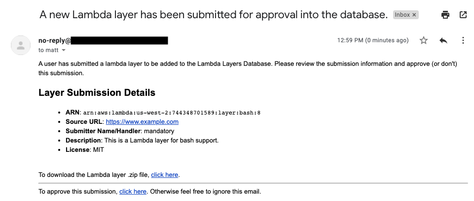

# The Lambda Layers Database
## By the [refinery.io](https://refinery.io) Team

# Summary

This is a service to index AWS Lambda layers and provide a searchable database for them. In addition to being a functional API for searching and indexing layers this service also provides the following functionality:

* The ability to process user submissions for new layers. New submissions are sent via email to the configured admin email address for approval.
* Automatic mirroring across multiple AWS regions for imported layers. Layer submissions that are approved are automatically created/mirrored across all AWS regions in the configured AWS account. This allows 1-click copy and use functionality regardless of what region the Lambda that needs to use the layer is in.
* Search all Lambda layers in the database.
* Download a `.zip` from a supplied Lambda ARN.

# Configuration

You should follow these steps in order.

## Requirements

* A working AWS account.
* A working and configured [`aws` CLI](https://aws.amazon.com/cli/). This needs to be run with priveleges to create and configure S3 buckets and Lambda layers (across all regions).
* Node v10.16.3 (likely 10+ will work).

## Install Dependencies

```bash
# Navigate to the project directory
cd lambda-layers-database/

# Use npm to install dependencies
npm install
```

## Generate S3 Buckets for Each Supported Region

For this service to work properly an S3 bucket in each supported region must be created. This is because, in order to create larger Lambda layers, the layer `.zip` file must be uploaded to an S3 bucket first.

To create the required buckets, a bash script has been provided to make the process easy. Simply do the following:

```bash
# Run the create buckets script
./create-buckets.sh
```

This will randomly generate a bucket prefix and create a bucket in each region with the following naming-convention:
`LOWERCASE( layers-{{RANDOM_UUIDV4}}-{{AWS_REGION_ID}}) `

Once the script has finished, it will also create a `config.env` environment variable file containing the S3 bucket prefix:

```bash
export LAMBDA_LAYERS_S3_PREFIX=layers-df6d24eb-5ac9-4911-8dbb-a3a451709006
```

Now you will just need to add the rest of the required environment variables to this file, see below for how to do this.

## Setting Environment Variables

The following environment variables exist for this service (the optional ones are noted as such). Note that while a Mailgun API key/account is not required, it's highly reccomended as the approval system works via email.

* `DATABASE_NAME`: Postgres database name.
* `DATABASE_USER`: Postgres database user with permissions to create and use tables.
* `DATABASE_PASSWORD`: Postgres user password.
* `DATABASE_HOST`: Postgres database host (IP/hostname).
* *Optional* `MAILGUN_API_KEY`: [Mailgun](https://www.mailgun.com/) API key for sending user submission approval emails.
* *Optional* `MAILGUN_DOMAIN`: Your Mailgun sending domain name.
* `WEB_ORIGIN`: The web origin of the API server, this is used for CORS headers and generating approval links. Should be in the format like `{{HTTP|HTTPS}}://hostname.suffix`, for example `http://localhost:7777` or `https://production.example.com`.
* `ADMIN_EMAIL_ADDRESS`: The email address to send approval emails to.

# Approval Process

* User submits Lambda layer along with information about the layer (`POST /api/v1/layers/submit`)
* The admin email address is sent an approval email which contains an approval link. The approval link is unique per submission and once clicked will start the Lambda layer import and mirroring process.

An example of the approval email can be seen below:


